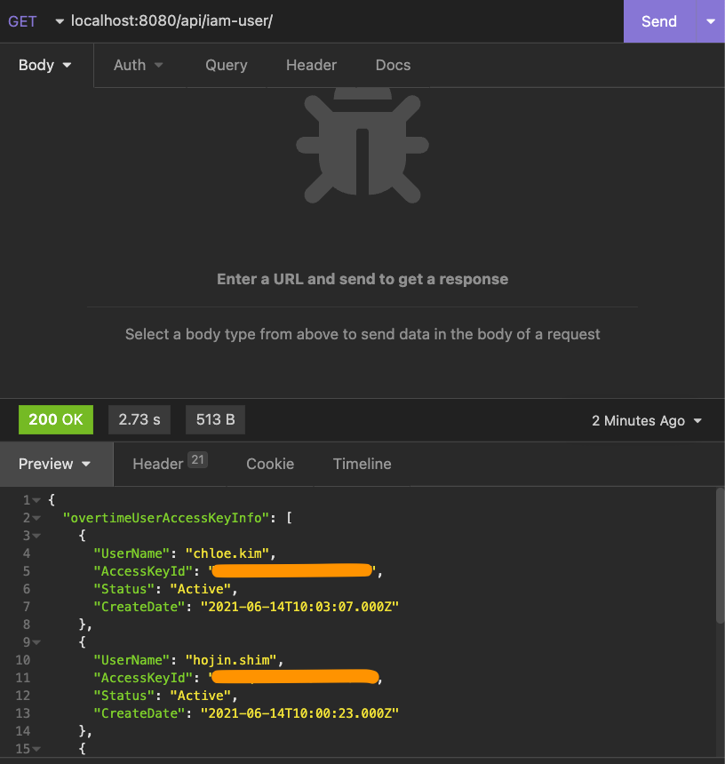

# Musinsa

### Backend

```javascript
const { IAMClient, ListUsersCommand, ListAccessKeysCommand } = require("@aws-sdk/client-iam");

require("dotenv").config();
const iamClient = new IAMClient({ region: process.env.REGION })
const moment = require("moment");

// 해당 IAM 유저의 User name
// 해당 IAM 유저의 "AKIA" 로 시작하는 Access Key ID
// 해당 Access Key 의 생성 시간
exports.getOldIamUser = async (req, res, next) => {
    try {
        const listUsersParams = {};
        const overtime = process.env.OVER_TIME;
        let overtimeUserInfo = [];
        let overtimeUserAccessKeyInfo = [];

        const data = await iamClient.send(new ListUsersCommand(listUsersParams))

        data.Users.filter(a => {
            const now = moment().format("YYYY-MM-DD HH:mm:ss");
            const old = moment(a.CreateDate).format("YYYY-MM-DD HH:mm:ss");
            const diff = moment(now).diff(old, "hours");
            if (diff > overtime) {
                overtimeUserInfo.push({ UserName: a.UserName });
            }
        })

        for (let i=0; i<overtimeUserInfo.length; i++) {
            const listAccessKeysParams = {
                UserName: overtimeUserInfo[i].UserName
            }
            const data = await iamClient.send(new ListAccessKeysCommand(listAccessKeysParams));
            overtimeUserAccessKeyInfo.push(data.AccessKeyMetadata)
        }
        overtimeUserAccessKeyInfo = overtimeUserAccessKeyInfo.flat();
        res.status(200).json({ overtimeUserAccessKeyInfo });
    } catch (err) {
        next(err);
    }
}
```

Access Key Pair 가 생성된 후 OVER_TIME 을 초과하는 IAM User 를 찾아 출력하도록 하는 간단한 API 를 구현했다.




[aws-sdk 참고 자료](https://docs.aws.amazon.com/ko_kr/sdk-for-javascript/v3/developer-guide/iam-examples.html)

### Dockerfile

.dockerignore 에서 .env 파일을 제외했기 때문에 ENV 로 환경 변수들을 입력받아야 한다.

AWS_ACCESS_KEY_ID, AWS_SECRET_ACCESS_KEY 는 k8s secret 오브젝트로 전달하고 나머지는 config 오브젝트로 환경 변수를 전달할 예정이다.

```
FROM node:16.15.1-alpine
WORKDIR /app
COPY package*.json ./
ENV PORT $PORT
ENV AWS_ACCESS_KEY_ID $AWS_ACCESS_KEY_ID
ENV AWS_SECRET_ACCESS_KEY $AWS_SECRET_ACCESS_KEY
ENV OVER_TIME $OVER_TIME
ENV REGION $REGION
RUN npm install
COPY . .
CMD ["npm", "run", "start"]
EXPOSE 8080
```

도커 허브 레지스트리에 이미지를 올린다.

```bash
docker build -t how0326/musinsa .
docker push how0326/musinsa
```