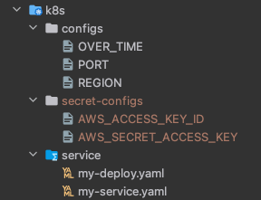

# Musinsa

### Backend

```javascript
const { IAMClient, ListUsersCommand, ListAccessKeysCommand } = require("@aws-sdk/client-iam");

require("dotenv").config();
const iamClient = new IAMClient({ region: process.env.REGION })
const moment = require("moment");

// 해당 IAM 유저의 User name
// 해당 IAM 유저의 "AKIA" 로 시작하는 Access Key ID
// 해당 Access Key 의 생성 시간
exports.getOldIamUser = async (req, res, next) => {
    try {
        const listUsersParams = {};
        const overtime = process.env.OVER_TIME;
        let overtimeUserInfo = [];
        let overtimeUserAccessKeyInfo = [];

        const data = await iamClient.send(new ListUsersCommand(listUsersParams))

        data.Users.filter(a => {
            const now = moment().format("YYYY-MM-DD HH:mm:ss");
            const old = moment(a.CreateDate).format("YYYY-MM-DD HH:mm:ss");
            const diff = moment(now).diff(old, "hours");
            if (diff > overtime) {
                overtimeUserInfo.push({ UserName: a.UserName });
            }
        })

        for (let i=0; i<overtimeUserInfo.length; i++) {
            const listAccessKeysParams = {
                UserName: overtimeUserInfo[i].UserName
            }
            const data = await iamClient.send(new ListAccessKeysCommand(listAccessKeysParams));
            overtimeUserAccessKeyInfo.push(data.AccessKeyMetadata)
        }
        overtimeUserAccessKeyInfo = overtimeUserAccessKeyInfo.flat();
        res.status(200).json({ overtimeUserAccessKeyInfo });
    } catch (err) {
        next(err);
    }
}
```

Access Key Pair 가 생성된 후 OVER_TIME 을 초과하는 IAM User 를 찾아 출력하도록 하는 간단한 API 를 구현했다.


[aws-sdk 참고 자료](https://docs.aws.amazon.com/ko_kr/sdk-for-javascript/v3/developer-guide/iam-examples.html)

### Dockerfile

.dockerignore 에서 .env 파일을 제외했기 때문에 ENV 로 환경 변수들을 입력받아야 한다.

AWS_ACCESS_KEY_ID, AWS_SECRET_ACCESS_KEY 는 k8s secret 오브젝트로 전달하고 나머지는 config 오브젝트로 환경 변수를 전달할 예정이다.

```
FROM node:16.15.1-alpine
WORKDIR /app
COPY package*.json ./
ENV PORT $PORT
ENV AWS_ACCESS_KEY_ID $AWS_ACCESS_KEY_ID
ENV AWS_SECRET_ACCESS_KEY $AWS_SECRET_ACCESS_KEY
ENV OVER_TIME $OVER_TIME
ENV REGION $REGION
RUN npm install
COPY . .
CMD ["npm", "run", "start"]
EXPOSE 8080
```

도커 허브 레지스트리에 이미지를 올린다.

```bash
docker login
docker build -t how0326/musinsa .
docker push how0326/musinsa
```

### k8s

아래 명령어로 minikube 를 실행한다.

```bash
minikube start --nodes 3
```


how0326/musinsa 컨테이너에게 환경 변수를 넘겨줘야 한다.

각각의 값들은 secret, configmap 오브젝트를 사용하여 환경 변수로 넘겨줄 것이다.

실제 디렉토리 구조는 아래와 같다.



Dockerfile 에서 입력받을 환경 변수를 configMap 파일과 secret 파일에 작성한 후 아래 명령어를 실행하여 secret, configmap 오브젝트를 생성한다.

```bash
# cd ~/musinsa/k8s 
kubectl create secret generic secret-configs --from-file=secret-configs  
kubectl create configmap configs --from-file=configs
```

해당 오브젝트들이 생성이 됐는지 아래 명령어로 확인한다.

```bash
kubectl get secret,configmap
```


envFrom 항목을 사용하여 secret 오브젝트와 configmap 오브젝트를 컨테이너의 환경 변수로 넘겨준다.

```yaml
# my-deploy.yaml
...
      containers:
        - name: my-app
          image: how0326/musinsa
          envFrom:
            - secretRef:
                name: secret-configs
            - configMapRef:
                name: configs
```

실제로 컨테이너 환경 변수로 입력됐는지 확인하기 위해 아래 명령어를 사용하여 확인한다.

```bash
kubectl get 
kubectl exec pod/old-iam-users-app-b47b58b77-hw6tk -- printenv
```


deployment 전체 코드는 아래와 같다. 

레플리카 갯수는 3개로 지정해줬고 probe 를 설정하여 get 요청으로 health 체크 API 를 실행하여 컨테이너에 문제가 없음을 확인하도록 설정했다.

```yaml
# my-deploy.yaml
apiVersion: apps/v1
kind: Deployment
metadata:
  labels:
    app: old-iam-users-app
    env: production
  name: old-iam-users-app
spec:
  replicas: 3
  selector:
    matchLabels:
      env: production
  template:
    metadata:
      labels:
        env: production
        app: old-iam-users-app
    spec:
      containers:
        - name: old-iam-users-app
          image: how0326/musinsa
          resources:
            requests:
              memory: "1024Mi"
              cpu: "500m"
            limits:
              memory: "1024Mi"
              cpu: "500m"
          ports:
            - containerPort: 8080
          envFrom:
            - secretRef:
                name: secret-configs
            - configMapRef:
                name: configs
          livenessProbe:
            httpGet:
              path: /api/health
              port: 8080
            initialDelaySeconds: 10
            periodSeconds: 5
            successThreshold: 1
            timeoutSeconds: 5
            failureThreshold: 5
          readinessProbe:
            httpGet:
              path: /api/health
              port: 8080
            initialDelaySeconds: 10
            periodSeconds: 5
            successThreshold: 1
            failureThreshold: 5
            timeoutSeconds: 5
```

service 는 NodePort 타입으로 설정하여 minikube service old-iam-users 명령어를 사용하여 외부에 노출시키도록 설정했다.

```yaml
apiVersion: v1
kind: Service
metadata:
  name: old-iam-users
  labels:
    env: production
spec:
  type: NodePort
  selector:
    env: production
    app: old-iam-users-app
  ports:
    - port: 80
      targetPort: 8080
```

아래 명령어를 실행하여 오브젝트를 생성한다.

```bash
# ~/musinsa/k8s/service
kubectl create -f my-deploy.yaml -f my-service.yaml
```


아래 minikube 명령어를 입력하여 서비스를 터널링하여 외부에서 접근할 수 있도록 한다.

```bash
minikube service old-iam-users
```


실제 API 가 아래 그림처럼 잘 작동하는 것을 확인할 수 있다.


실제 본인 IAM 계정으로 테스트를 하고자 한다면 secret-configs 디렉토리의 AWS_ACCESS_KEY_ID, AWS_SECRET_ACCESS_KEY 파일 안에 값을 본인 AWS IAM 계정의 키와 시크릿 키를 넣은 후, configs 디렉토리 안의 OVER_TIME 파일 안의 값을 원하는 시간으로 변경하고 secret, configmap 오브젝트 삭제 후 재생성한다.


